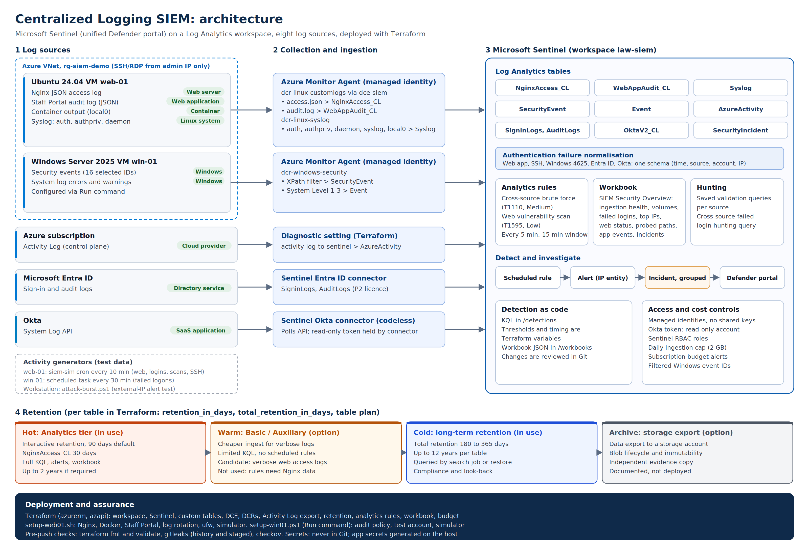

# Centralized Logging SIEM

A centralized logging and detection platform built on **Microsoft Sentinel**. It collects logs from eight source types into one Log Analytics workspace, provides a security dashboard and analytics rules that raise incidents, and applies tiered retention per table. The logging platform is deployed with Terraform; client machines are configured with setup scripts.



## Log sources

| Requirement | Source | Collection method | Table |
|---|---|---|---|
| Web server | Nginx on `web-01` (Ubuntu 24.04) | Azure Monitor Agent, custom log file | `NginxAccess_CL` |
| Web application | Staff Portal (Flask) security audit log | Azure Monitor Agent, custom log file | `WebAppAudit_CL` |
| Container | Staff Portal container output (Docker syslog driver) | Azure Monitor Agent, Syslog facility `local0` | `Syslog` |
| Linux system | `web-01` sshd, sudo, services | Azure Monitor Agent, Syslog | `Syslog` |
| Windows system | `win-01` (Windows Server 2025) | Azure Monitor Agent, Windows events | `SecurityEvent`, `Event` |
| Cloud provider | Azure subscription Activity Log | Diagnostic setting | `AzureActivity` |
| Directory service | Microsoft Entra ID | Sentinel Entra ID connector | `SigninLogs`, `AuditLogs` |
| SaaS application | Okta System Log API | Sentinel Okta connector | `OktaV2_CL` |

## Documentation

| Step | Document |
|---|---|
| Architecture and design decisions | [01-architecture.md](docs/01-architecture.md) |
| Prerequisites | [02-prerequisites.md](docs/02-prerequisites.md) |
| Deploy the SIEM platform (Terraform) | [03-deploy-siem.md](docs/03-deploy-siem.md) |
| Onboard Linux: web server, web application, container, system logs | [04-onboard-linux.md](docs/04-onboard-linux.md) |
| Onboard Windows, Azure, Entra ID and Okta | [05-onboard-windows-cloud-saas.md](docs/05-onboard-windows-cloud-saas.md) |
| Dashboard and alerts | [06-dashboard-and-alerts.md](docs/06-dashboard-and-alerts.md) |
| Retention options and hot/warm/cold strategy | [07-retention.md](docs/07-retention.md) |
| Security considerations | [08-security-considerations.md](docs/08-security-considerations.md) |
| Further improvements | [09-improvements.md](docs/09-improvements.md) |

Follow documents 02 to 06 in order to build the environment from scratch.

## Highlights

- **Dashboard:** *SIEM Security Overview* workbook with ingestion health, volume per source, failed logins across all authentication sources, top attacking IPs, web status trends, probed paths, application events and incidents. Defined in `workbooks/security-overview.json`.
- **Alerts:** *Brute-force login attempts across sources* (web app, SSH, Windows, Entra ID and Okta normalised and counted together; MITRE T1110) and *Web vulnerability scanning* (MITRE T1595). KQL in `detections/`, thresholds and timing as Terraform variables.
- **Retention:** per-table interactive and long-term retention in Terraform, with a documented hot/warm/cold strategy.
- **Security:** managed identities, least-privilege tokens, hardened container, no secrets in Git, secret and IaC scanning before every push.

## Repository structure

```
terraform/          Logging platform as code: workspace, Sentinel, custom tables, DCE and DCRs,
                    Activity Log export, retention, analytics rules, workbook, budget
detections/         KQL for analytics rules (templated thresholds) and hunting queries
workbooks/          Security Overview workbook definition (JSON)
clients/linux/      web-01: setup script, Nginx config, Docker Compose, log rotation
clients/windows/    win-01: setup script (audit policy, test account, simulator)
app/                Staff Portal web application and Dockerfile
simulator/          Traffic and attack generators for testing
scripts/            Pre-push security and quality checks
docs/               Setup guides, design, retention, security, improvements
```

## Quick start

```powershell
az login
$env:ARM_SUBSCRIPTION_ID = az account show --query id -o tsv
cd terraform
Copy-Item terraform.tfvars.example terraform.tfvars   # set alert_email
terraform init
terraform plan -out tfplan
terraform apply tfplan
```

Then onboard the sources with documents 04 and 05.

## Before every push

```powershell
git add <files>
.\scripts\pre-push-checks.ps1
```

Runs `terraform fmt`, `terraform validate`, `gitleaks` (history and staged changes) and `checkov`.

## Cost

The environment runs within an Azure free trial: two burstable VMs, a 2 GB/day ingestion cap and a subscription budget with email alerts at 50% (actual) and 90% (forecast). Remove everything by deleting the VMs and running `terraform destroy` (see [03-deploy-siem.md](docs/03-deploy-siem.md)).
